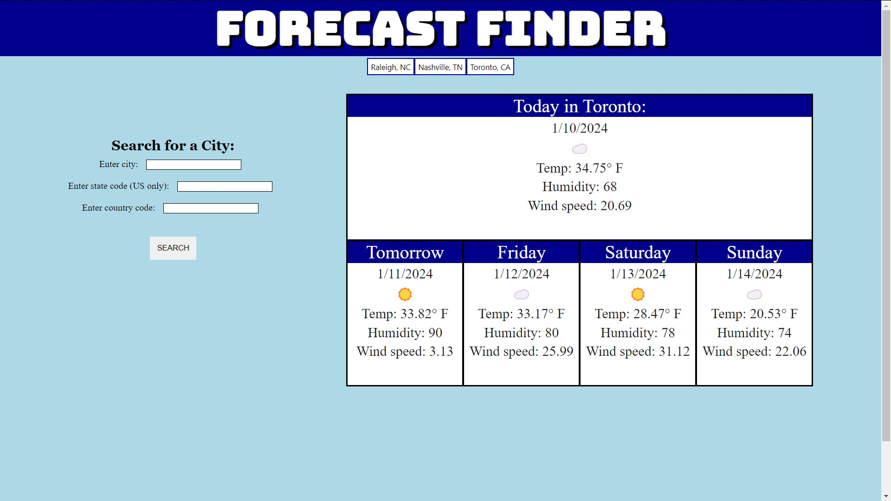

# Forecast Finder weather application

https://chairsitter.github.io/WeatherApp/

## Description

This application uses the free OpenWeather weather API to provide a 5-day forecast interface for the user. The application accepts a city search and populates data for
the current day and 4 days into the future. Searches are saved as buttons at the top of the screen, and these buttons persist when the page is re-loaded using local storage.

- This project was useful to practice navigating API documentation and accessing data from JSON objects. The final product is a useful weather app. 
- I built this project to provide a useful weather search application and to practice the details involved with accessing information from an API, displaying it, 
and creating an intuitive interface for the user.
- This application provides a quick and easy interface for searching US and international weather forecasts, and give the user access to past searches via buttons 
that do no duplicate when the same search is made again.
- I learned how to navigate documentation and JSON data objects provided by an API for accessing weather-related database information. I learned techniques to make
a friendly user interface including buttons that are dynamically created based on unique searches, using a switch statement to convert weather words into icons, and 
ensuring the same search does not create multiple of the same button. I also learned the unique challenge of programming an application using an API that limits the amount of
calls per hour, and I commented out the API call code as needed to avoid excess calls. 

## Usage

The user can access weather data for the current day and 4 additional days by typing a city name, a 2-letter state code (if US), and a 2-letter country code. 
The user can quickly access the forecast for a previously-searched city by clicking the appropriate button that populates at the top of the page.
As this project uses a free API, there is a limit of 60 calls per hour among all users. 

## Credits

I designed the HTML and CSS layout and the javascript code that accesses weather data and manipulates HTML and CSS code. 
This project uses the free OpenWeather 5-day forecast API, and credit is due to OpenWeather for providing this free content which is leveraged in the weather app. 

## License

This project uses a MIT license. Please refer to the MIT license file in this repository.

